# games-website

A project done in pairs where we had to create a games website.

## Contents

* [Built With](#built-with)
* [Features](#features)
* [Interfaces](#interfaces)

## Built With

* PHP
* PostgreSQL

## Features

* Login Interface
  * Appropriate errors
  * Pre-fill form fields
* Registration Interface
  * Some interesting inputs, drop downs, check boxes, validated inputs, radio buttons
  * Some fields required, some fields not
  * Users get appropriate feedback on the registration form, in case of errors
* User Profile Interface
  * Allows the user to modify registration information
  * The values in form fields are pre-filled from the database
* Game Stats Interface
  * Pulls information from the database to list stats about games this user has played and others experience playing similar games
* Model-View-Controller (MVC) Framework
* A Front Controller which implements a finite state machine
* Security and web features as outlined in [Web Programming is Hard](http://www.cs.toronto.edu/~arnold/309/20s/lectures/webProgrammingIsHard/)

## Interfaces

* [Login](#login)
* [Registration](#registration)
* [User Profile](#user-profile)
* [Game Stats](#game-stats)

### Login

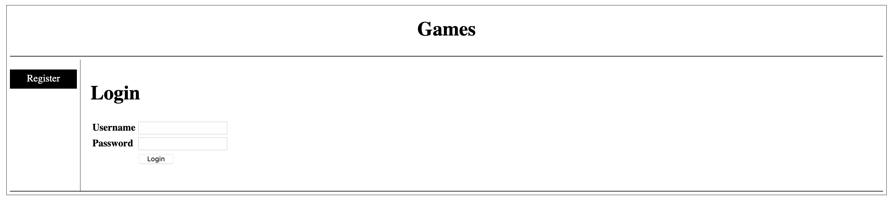

### Registration

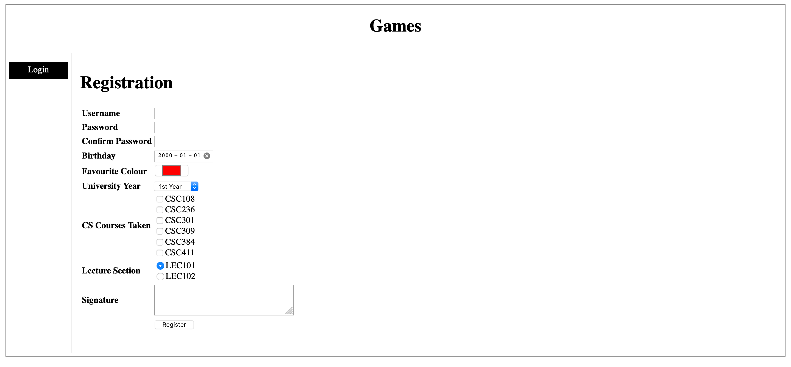

### User Profile

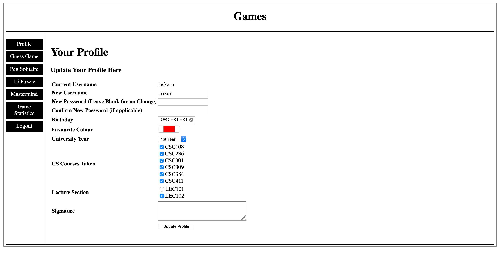

### Game Stats

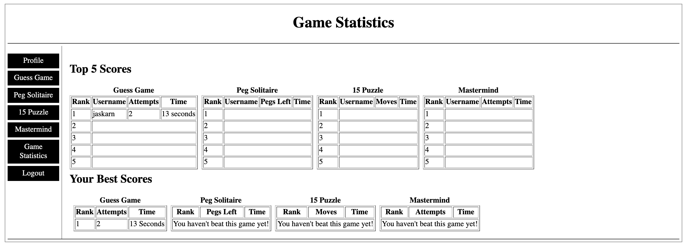

## Individual Games
**Please note actual games are not as slow as below since below are GIFs of games not videos!**

* [Guess Game](#guess-game)
* [The 15 Puzzle](#the-15-puzzle)
* [Peg Solitare](#peg-solitare)
* [Mastermind](#mastermind)

### Guess Game

#### Interface
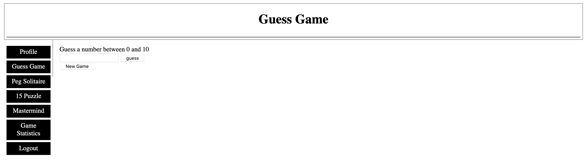

#### Gameplay
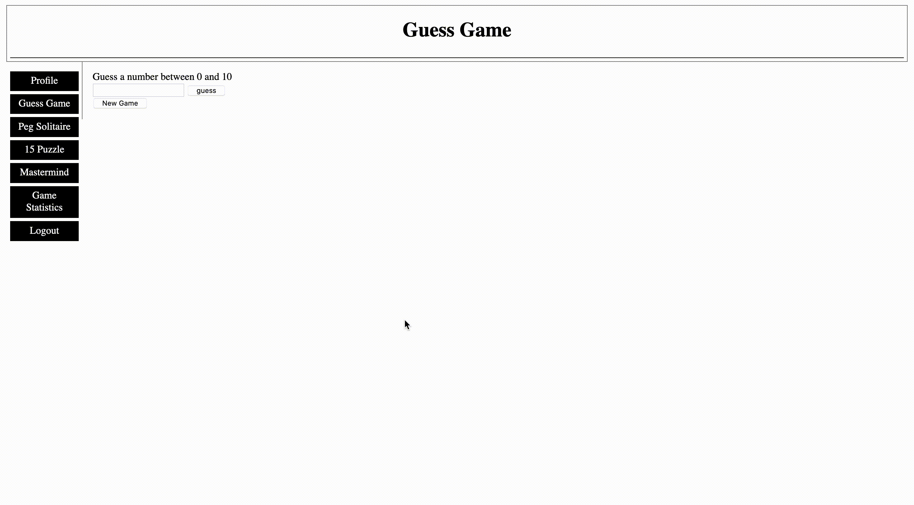

### The 15 Puzzle

#### Interface
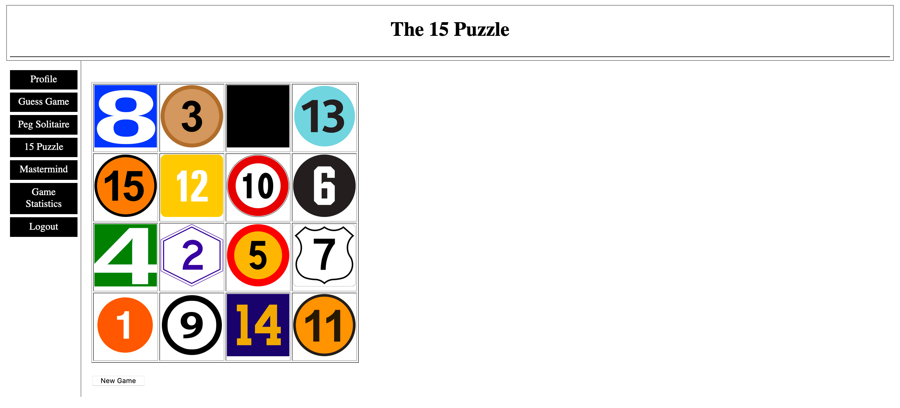

#### Gameplay
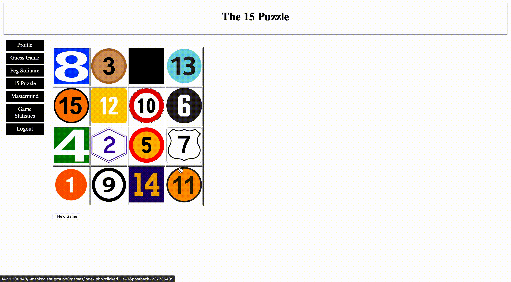

### Peg Solitare

#### Interface
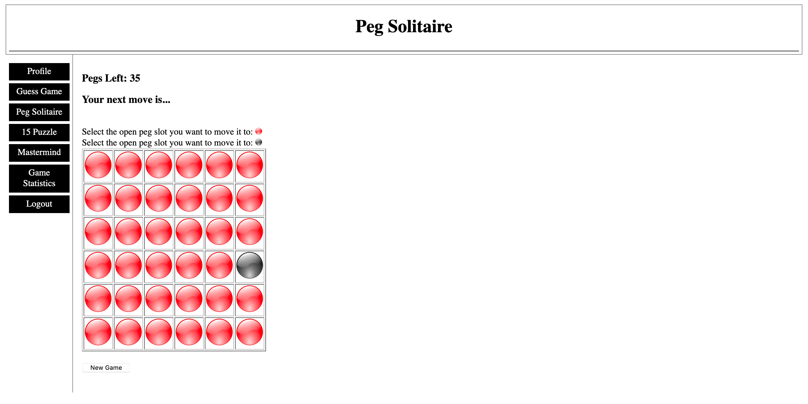

#### Gameplay
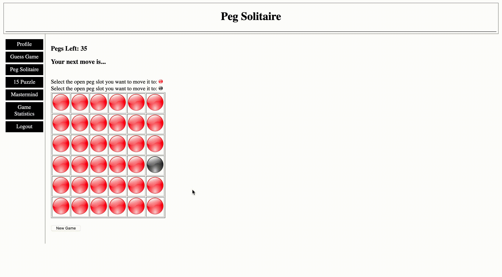

### Mastermind

#### Interface

#### Gameplay
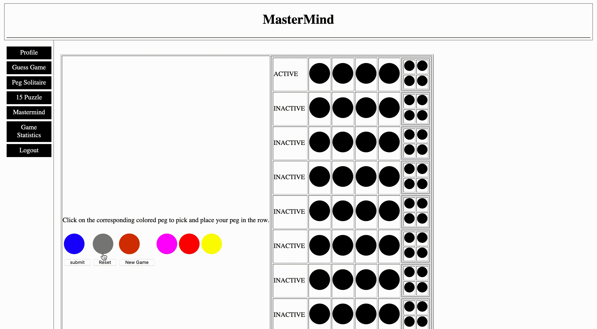
